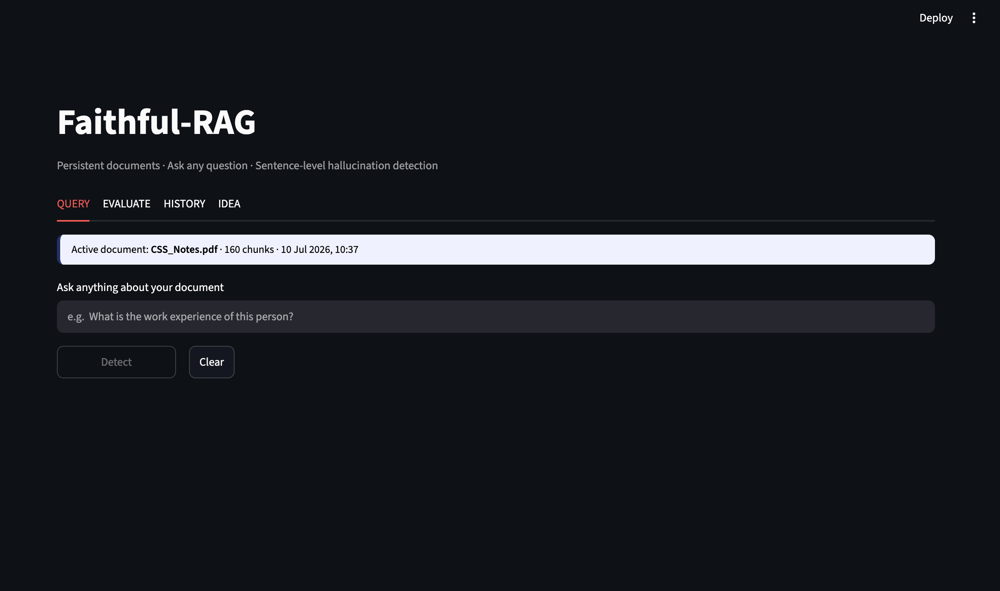
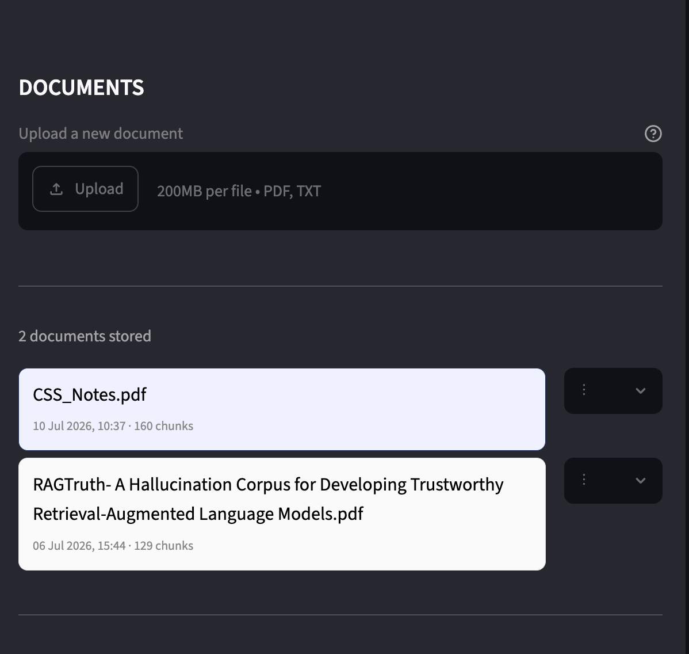
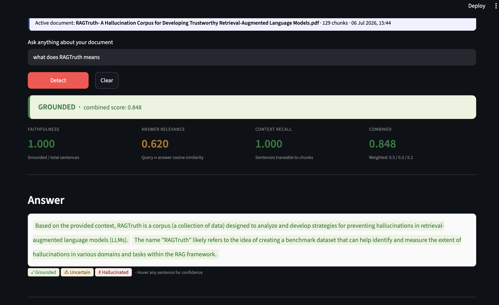
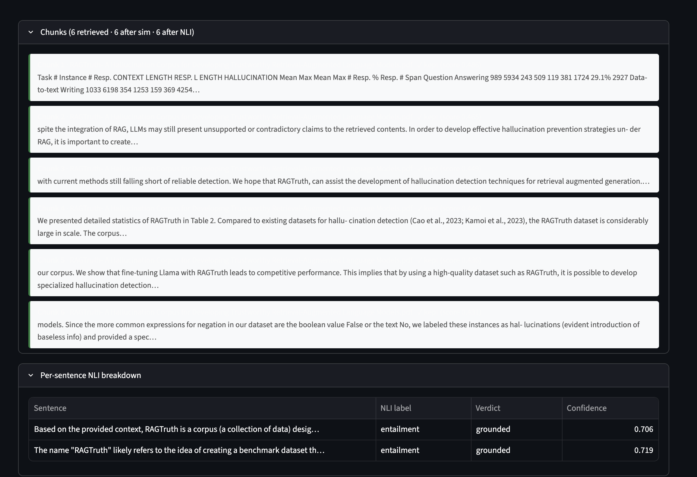
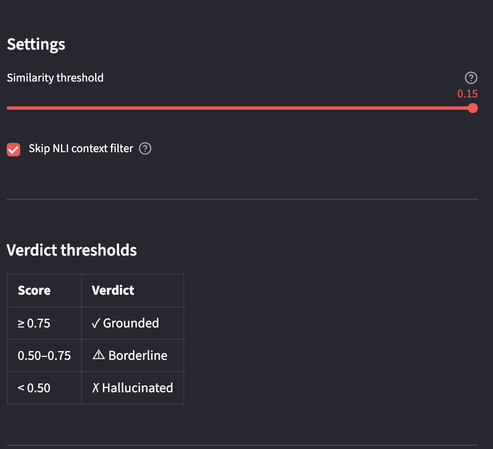

# Faithful-RAG: Hallucination-Aware Retrieval-Augmented Generation

A document-based Question Answering (QA) system that combines Retrieval-Augmented Generation (RAG) with a sentence-level hallucination verification pipeline. The application retrieves relevant information from user-uploaded documents, generates context-aware responses using a local Large Language Model (Llama 3.2), and verifies every generated sentence using Natural Language Inference (NLI) and retrieval-based evaluation metrics.

---

## Features

- Upload and manage PDF/TXT documents
- Semantic retrieval using FAISS vector database
- Local LLM inference with Llama 3.2 via Ollama
- Sentence-level hallucination detection using DeBERTa-v3 NLI
- Response evaluation using:
  - Faithfulness
  - Answer Relevance
  - Context Recall
  - Combined Verification Score
- Automatic response classification:
  - Grounded
  - Borderline
  - Hallucinated
- Interactive Streamlit interface

---

## Tech Stack

- Python
- Streamlit
- LangChain
- FAISS
- Sentence Transformers
- Hugging Face Transformers
- Ollama
- Llama 3.2
- SQLite

---

# Application Preview

## Home Page

Ask natural language questions about the selected document.



---

## Document Management

Upload, manage and index PDF/TXT documents for semantic retrieval.



---

## Generated Response & Verification

The system generates answers along with Faithfulness, Answer Relevance, Context Recall and Combined Verification Score before classifying the response.



---

## Retrieved Chunks & NLI Verification

View retrieved document chunks together with sentence-level NLI predictions used during hallucination verification.



---

## Settings

Adjust similarity thresholds and hallucination classification thresholds.



---

# ⚙️ Workflow

```text
Upload Document
      │
      ▼
Document Chunking
      │
      ▼
Sentence Embeddings
(all-MiniLM-L6-v2)
      │
      ▼
FAISS Vector Store
      │
      ▼
Semantic Retrieval
      │
      ▼
Llama 3.2 (Ollama)
      │
      ▼
Sentence-Level Verification
(DeBERTa-v3 NLI)
      │
      ▼
Faithfulness
Answer Relevance
Context Recall
      │
      ▼
Combined Verification Score
      │
      ▼
Grounded / Borderline / Hallucinated
```

---

# Project Structure

```text
Faithful-RAG/
│
├── phase4/
│   ├── app.py
│   ├── unified_eval_results_summary.csv
│   └── ...
│
├── screenshots/
├── uploads/
├── vector_store/
├── requirements.txt
└── README.md
```

---

# Evaluation

The framework was evaluated on **10 research papers** from domains including Retrieval-Augmented Generation, Natural Language Processing, Deep Learning, and Computer Vision.

The evaluation measured:

- Retrieval quality
- Hallucination detection
- Faithfulness
- Answer Relevance
- Context Recall
- Overall response classification

The complete evaluation results are available in:

```text
phase4/unified_eval_results_summary.csv
```

### Overall Performance

| Metric | Value |
|---------|------:|
| Accuracy | **95.7%** |
| Precision | **76.9%** |
| Recall | **100%** |
| F1-Score | **87.0%** |

---

# Installation

Clone the repository

```bash
git clone https://github.com/khuxhnumaa/Faithful-RAG.git
cd Faithful-RAG
```

Create a virtual environment

### macOS/Linux

```bash
python3 -m venv venv
source venv/bin/activate
```

### Windows

```bash
python -m venv venv
venv\Scripts\activate
```

Install dependencies

```bash
pip install -r requirements.txt
```

Install Ollama

```bash
ollama pull llama3.2:3b
```

---

# ▶️ Running the Application

Start Ollama first, then run:

```bash
streamlit run phase4/app.py
```

The application will automatically open in your browser.

---

# Future Improvements

- Hybrid Retrieval (BM25 + FAISS)
- Multi-document reasoning
- Citation highlighting
- Conversation memory
- Docker deployment
- Cloud-based LLM support

---

# Author

**Khushnuma Parveen**

B.Tech – Artificial Intelligence  
Zakir Husain College of Engineering and Technology  
Aligarh Muslim University

---

# License

This project is developed for educational and research purposes.